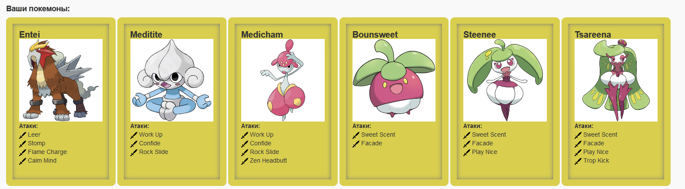

# Лабораторная #1 #
Написать программу на языке Java, выполняющую соответствующие варианту действия. Программа должна соответствовать следующим требованиям:
1. Она должна быть упакована в исполняемый jar-архив.
2. Выражение должно вычисляться в соответствии с правилами вычисления математических выражений (должен соблюдаться порядок выполнения действий и т.д.).
3. Программа должна использовать математические функции из стандартной библиотеки Java.
4. Результат вычисления выражения должен быть выведен в стандартный поток вывода в заданном формате.

Выполнение программы необходимо продемонстрировать на сервере `helios`.

1. Создать одномерный массив m типа int. Заполнить его нечётными числами от 7 до 19 включительно в порядке возрастания.
2. Создать одномерный массив x типа float. Заполнить его 19-ю случайными числами в диапазоне от -11.0 до 12.0.
3. Создать двумерный массив u размером 7x19. Вычислить его элементы по следующей формуле (где x = x[j]):
    - если m[i] = 13, то u[i][j]=tan(ln(cos^2(x)));
    - если m[i] ∈ {7, 9, 11}, то u[i][j]=(((1/2⋅(1−x))^x−12)/0.25)^3;
    - для остальных значений m[i]: u[i][j]=arcsin(sin(ln(4⋅|x|/5))).
4. Напечатать полученный в результате массив в формате с двумя знаками после запятой.

# Лабораторная #2 #
На основе базового класса `Pokemon` написать свои классы для заданных видов покемонов. Каждый вид покемона должен иметь один или два типа и стандартные базовые характеристики:
- очки здоровья (HP)
- атака (attack)
- защита (defense)
- специальная атака (special attack)
- специальная защита (special defense)
- скорость (speed)

Классы покемонов должны наследоваться в соответствии с цепочкой эволюции покемонов. На основе базовых классов PhysicalMove, SpecialMove и StatusMove реализовать свои классы для заданных видов атак. Атака должна иметь стандартные тип, силу (power) и точность (accuracy). Должны быть реализованы стандартные эффекты атаки. Назначить каждому виду покемонов атаки в соответствии с вариантом. Уровень покемона выбирается минимально необходимым для всех реализованных атак. Используя класс симуляции боя Battle, создать 2 команды покемонов (каждый покемон должен иметь имя) и запустить бой. Базовые классы и симулятор сражения находятся в [jar-архиве](https://se.ifmo.ru/documents/10180/660917/Pokemon.jar/a7ce60af-6ee6-47d0-a95e-e5ed9a697bd2). Документация в формате javadoc - [здесь](https://se.ifmo.ru/~tony/doc/). Информацию о покемонах, цепочках эволюции и атаках можно найти на сайтах http://poke-universe.ru, http://pokemondb.net, http://veekun.com/dex/pokemon

**Комментарии**

Цель работы: на простом примере разобраться с основными концепциями ООП и научиться использовать их в программах.

Что надо сделать (краткое описание):
1. Ознакомиться с [документацией](https://se.ifmo.ru/~tony/doc/), обращая особое внимание на классы `Pokemon` и `Move`. При дальнейшем выполнении лабораторной работы читать документацию еще несколько раз.
2. Скачать файл Pokemon.jar. Его необходимо будет использовать как для компиляции, так и для запуска программы. Распаковывать его не надо! Нужно научиться подключать внешние jar-файлы к своей программе.
3. Написать минимально работающую программу и посмотреть как она работает.
    ```
    Battle b = new Battle();
    Pokemon p1 = new Pokemon("Чужой", 1);
    Pokemon p2 = new Pokemon("Хищник", 1);
    b.addAlly(p1);
    b.addFoe(p2);
    b.go();
    ```
4. Создать один из классов покемонов для своего варианта. Класс должен наследоваться от базового класса `Pokemon`. В конструкторе нужно будет задать типы покемона и его базовые характеристики. После этого попробуйте добавить покемона в сражение.
5. Создать один из классов атак для своего варианта (лучше всего начать с физической или специальной атаки). Класс должен наследоваться от класса `PhysicalMove` или `SpecialMove`. В конструкторе нужно будет задать тип атаки, ее силу и точность. После этого добавить атаку покемону и проверить ее действие в сражении. Не забудьте переопределить метод `describe`, чтобы выводилось нужное сообщение.
6. Если действие атаки отличается от стандартного, например, покемон не промахивается, либо атакующий покемон также получает повреждение, то в классе атаки нужно дополнительно переопределить соответствующие методы (см. документацию). При реализации атак, которые меняют статус покемона (наследники `StatusMove`), скорее всего придется разобраться с классом `Effect`. Он позволяет на один или несколько ходов изменить состояние покемона или модификатор его базовых характеристик.
7. Доделать все необходимые атаки и всех покемонов, распределить покемонов по командам, запустить сражение.



# Лабораторная #3 #
Описание предметной области, по которой должна быть построена объектная модель:
>Коротышка выложил из кармана денежки и, получив акции, удалился. А желающих приобрести акции с каждым днем становилось все больше. Незнайка и Козлик с утра до вечера продавали акции, Мига же только и делал, что ездил в банк. Там он обменивал вырученные от продажи мелкие деньги на крупные и складывал их в несгораемый шкаф. Многие покупатели являлись в контору слишком рано. От нечего делать они толклись на улице, дожидаясь открытия конторы. Это привлекало внимание прохожих. Постепенно всем в городе стало известно, что акции Общества гигантских растений пользуются большим спросом.

**Программа должна удовлетворять следующим требованиям:**
1. Доработанная модель должна соответствовать принципам SOLID.
2. Программа должна содержать как минимум два интерфейса и один абстрактный класс (номенклатура должна быть согласована с преподавателем).
3. В разработанных классах должны быть переопределены методы equals(), toString() и hashCode().
4. Программа должна содержать как минимум один перечисляемый тип (enum).

**Порядок выполнения работы:**
1. Доработать объектную модель приложения.
2. Перерисовать диаграмму классов в соответствии с внесёнными в модель изменениями.
3. Согласовать с преподавателем изменения, внесённые в модель.
4. Модифицировать программу в соответствии с внесёнными в модель изменениями.

# Лабораторная #4 #

Доработать программу из лабораторной работы #3, обновив реализацию объектной модели в соответствии с новой версией описания предметной области.

Описание предметной области, по которой должна быть построена объектная модель:

>Пожав каждому из покупателей руку, Мига выпроводил их всех из конторы и бросился обнимать Незнайку и Козлика. Дело действительно быстро пошло на лад. Правда, в этот день покупатели больше не появлялись, зато когда Мига и Жулио пришли в контору на следующий день, они обнаружили, что торговля акциями идет довольно бойко. Перед Незнайкой и Козликом то и дело появлялись разные коротышки и выкладывали на стол свои денежки. Здесь были уже не только деревенские жители, но даже и городские. Один из них рассказал нашим друзьям, что когда-то давно он ушел из деревни, где у него остался небольшой клочок земли. Он мечтал поступить куда-нибудь на завод или на фабрику и подзаработать денег, чтоб прикупить земли, так как его клочок давал очень небольшой урожай. В конце концов ему удалось устроиться рабочим на фабрику, однако за долгие годы работы он так и не смог скопить сумму, которой хватило бы на покупку земли. Коротышка выложил из кармана денежки и, получив акции, удалился. А желающих приобрести акции с каждым днем становилось все больше. Незнайка и Козлик с утра до вечера продавали акции, Мига же только и делал, что ездил в банк. Там он обменивал вырученные от продажи мелкие деньги на крупные и складывал их в несгораемый шкаф. Многие покупатели являлись в контору слишком рано. От нечего делать они толклись на улице, дожидаясь открытия конторы. Это привлекало внимание прохожих. Постепенно всем в городе стало известно, что акции Общества гигантских растений пользуются большим спросом. Городские жители сообразили, что с течением времени цена на акции может повыситься. Все вспоминали об удивительном случае, когда акции одного нефтяного общества, купленные по одному фертингу штука, впоследствии продавались сначала по два, потом по три, потом по пять фертингов, а в тот день, когда стало известно, что из-под земли, где велись изыскательные работы, забил наконец нефтяной фонтан, цена на акции подскочила до десяти фертингов штука. Каждый, кто продал свои акции в этот день, получил в десять раз больше денег, чем истратил вначале. Наслушавшись подобных рассказов, каждый, кому удалось сберечь на черный день сотню-другую фертингов, спешил накупить гигантских акций, с тем чтоб продать их, как только они повысятся в цене. В результате два миллиона акций, хранившиеся в двух несгораемых сундуках, были быстро распроданы.

**Программа должна удовлетворять следующим требованиям:**
1. В программе должны быть реализованы 2 собственных класса исключений (checked и unchecked), а также обработка исключений этих классов.
2. В программу необходимо добавить использование локальных, анонимных и вложенных классов (static и non-static).

**Порядок выполнения работы:**
1. Доработать объектную модель приложения.
2. Перерисовать диаграмму классов в соответствии с внесёнными в модель изменениями.
3. Согласовать с преподавателем изменения, внесённые в модель.
4. Модифицировать программу в соответствии с внесёнными в модель изменениями.

# Лабораторная №5 #

Реализовать на базе программы из лабораторной работы №4 консольное приложение, которое реализует управление коллекцией объектов в интерактивном режиме. Номенклатуру сохраняемых в коллекции объектов необходимо заранее согласовать с преподавателем.

**Разработанная программа должна удовлетворять следующим требованиям:**
- Класс, коллекцией экземпляров которого управляет программа, должен реализовывать сортировку по умолчанию.
- Для хранения необходимо использовать коллекцию типа `java.util.LinkedList`.
- При запуске приложения коллекция должна автоматически заполняться значениями из файла.
- Имя файла должно передаваться программе с помощью переменной окружения.
- Данные должны храниться в файле в формате json.
- При остановке приложения текущее состояние коллекции должно автоматически сохраняться в файл.
- Чтение данных из файла необходимо реализовать с помощью класса `java.io.InputStreamReader`.
- Запись данных в файл необходимо реализовать с помощью класса `java.io.OutputStreamWriter`.
- Все реализованные команды (см. ниже) должны быть задокументированы в формате javadoc.
- Формат задания объектов в командах - json.

**В интерактивном режиме программа должна поддерживать выполнение следующих команд:**
- `load`: перечитать коллекцию из файла
- `clear`: очистить коллекцию
- `info`: вывести в стандартный поток вывода информацию о коллекции (тип, дата инициализации, количество элементов и т.д.)
- `remove_all {element}`: удалить из коллекции все элементы, эквивалентные заданному
- `add {element}`: добавить новый элемент в коллекцию
- `remove_last`: удалить последний элемент из коллекции
- `remove {element}`: удалить элемент из коллекции по его значению
- `remove_greater {element}`: удалить из коллекции все элементы, превышающие заданный
- `show`: вывести в стандартный поток вывода все элементы коллекции в строковом представлении
- `add_if_min {element}`: добавить новый элемент в коллекцию, если его значение меньше, чем у наименьшего элемента этой коллекции

# Лабораторная №6 #

Разделить программу из лабораторной работы №5 на клиентский и серверный модули. Серверный модуль должен осуществлять выполнение команд по управлению коллекцией. Клиентский модуль должен в интерактивном режиме считывать команды, передавать их для выполнения на сервер и выводить результаты выполнения. Команда `import` должна использовать файл из файловой системы клиента (**содержимое** файла передается на сервер), `load` и `save` - сервера. Хранящиеся в коллекции объекты должны иметь следующие характеристики:
- имя, название или аналогичный текстовый идентификатор;
- размер или аналогичный числовой параметр;
- характеристику, определяющую местоположение объекта на плоскости/в пространстве;
- время/дату рождения/создания объекта.

Если аналогичные характеристики уже есть, добавлять их не нужно.

**Необходимо выполнить следующие требования:**
- Коллекцию из ЛР №5 заменить на ее потокобезопасный аналог.
- Операции обработки объектов коллекции должны быть реализованы с помощью - Stream API с использованием лямбда-выражений.
- Объекты между клиентом и сервером должны передаваться в сериализованном виде.
- Объекты в коллекции, передаваемой клиенту, должны быть отсортированы по названию.
- Получив запрос, сервер должен создавать отдельный поток, который должен формировать и отправлять ответ клиенту.
- Клиент должен корректно обрабатывать временную недоступность сервера.
- Обмен данными между клиентом и сервером должен осуществляться по протоколу TCP.
- На стороне сервера должен использоваться сетевой канал а на стороне клиента - потоки ввода-вывода.

# Лабораторная №7 #

Доработать программу из лабораторной работы №6 следующим образом:
1. В класс, объекты которого хранятся в коллекции, добавить поле типа `java.time.OffsetDateTime`, в котором должны храниться дата и время создания объекта.
2. Обеспечить возможность регистрации и авторизации пользователей.
3. При регистрации генерировать случайный пароль и отправлять его на почту, указанную при регистрации.
3. Для отправки почтовых уведомлений использовать `JavaMail API`.
4. Пароли при хранении хэшировать алгоритмом `SHA-1`.
5. Реализовать ассоциацию между объектом из коллекции и пользователем, его создавшим. Пользователи могут просматривать объекты, созданные всеми пользователями, а модифицировать - только свои.
6. Для идентификации пользователя отправлять логин и пароль с каждым запросом.
7. Обеспечить хранение всех данных (объектов коллекции, пользователей и ассоциаций) в реляционной базе данных

**Порядок выполнения работы:**
1. В качестве базы данных использовать PostgreSQL.
2. Для подключения к БД на кафедральном сервере использовать хост pg, имя базы данных - studs, имя пользователя/пароль совпадают с таковыми для подключения к серверу. 
3. Данные для подключения к почтовому серверу уточняются.

# Лабораторная №8 #

Доработать программу из лабораторной работы №7 следующим образом:

Заменить консольный клиент на клиент с графическим интерфейсом пользователя(GUI).
В функционал клиента должно входить:
1.	Окно с авторизацией/регистрацией.
2.	Отображение текущего пользователя.
3.	Таблица, отображающая все объекты из коллекции
    - Каждое поле объекта - отдельная колонка таблицы.
    - Строки таблицы можно фильтровать/сортировать по значениям любой из колонок. Сортировку и фильтрацию значений столбцов реализовать с помощью Streams API.
4.	Поддержка всех команд из предыдущих лабораторных работ.
5.	Область, визуализирующую объекты коллекции
    - Объекты должны быть нарисованы с помощью графических примитивов с использованием Graphics, Canvas или аналогичных средств графической библиотеки.
    - При визуализации использовать данные о координатах и размерах объекта.
    - Объекты от разных пользователей должны быть нарисованы разными цветами.
    - При нажатии на объект должна выводиться информация об этом объекте.
    - При добавлении/удалении/изменении объекта, он должен автоматически появиться/исчезнуть/измениться на области как владельца, так и всех других клиентов. 
    - При отрисовке объекта должна воспроизводиться согласованная с преподавателем анимация.
6.	Возможность редактирования отдельных полей любого из объектов (принадлежащего пользователю). Переход к редактированию объекта возможен из таблицы с общим списком объектов и из области с визуализацией объекта.
7.	Возможность удаления выбранного объекта (даже если команды remove ранее не было).

Перед непосредственной разработкой приложения необходимо согласовать прототип интерфейса с преподавателем. Прототип интерфейса должен быть создан с помощью средства для построения прототипов интерфейсов (mockplus, draw.io, etc.)

1. Интерфейс должен быть реализован с помощью библиотеки JavaFX
2. Графический интерфейс клиентской части должен поддерживать русский, португальский, болгарский и английский (Новая Зеландия) языки / локали. Должно обеспечиваться корректное отображение чисел, даты и времени в соответстии с локалью. Переключение языков должно происходить без перезапуска приложения. Локализованные ресурсы должны храниться в классе.